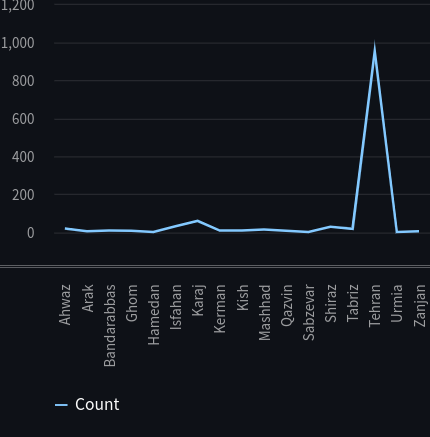
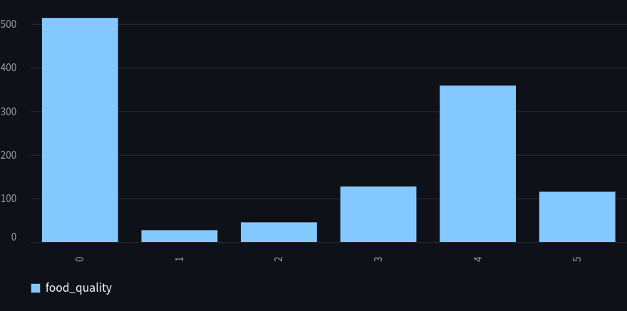

# Iran-restaurant-analyzer

**In this project data are crawled from the [fidilio](https://fidilio.com/coffeeshops/in/tehran/) and inserted into the sample database(MySQL).  
Over 1100 data have been collected...  
By using the interfaces data are used for analysis and shown as a dashboard using streamlit**

#### The following questions are answered:    

* What features can affect the rate of cafes?  
* Is the place of the cafe has an impact on rating?  
* Do food quality and service quality, etc. rates have a meaningful relationship with the rate of the cafe?  
* Does the time of work affect the cafe business?

### Installation
`pip3 install -r requirements.txt`

### Run streamlit
`streamlit run code/Home_Page.py`

### Plot Example

#### Cafe count per city

  

#### Food quality plot

  

